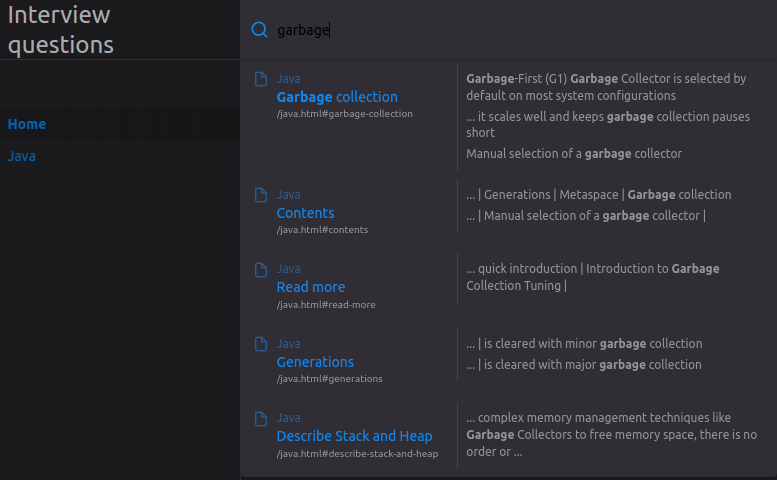

The rationale behind this project is to provide easy-to-digest answers to the most common questions that developers may 
encounter during technical interviews.

# Contents
{:.no_toc}

* TOC
{:toc}

# How to use this repository

The main table of contents points to general topics such as Java, time complexity, etc.

Each main topic has a dedicated table of contents that points to specific areas of interest, e.g. memory management in 
Java.

You can use the search bar to search for specific topics:

