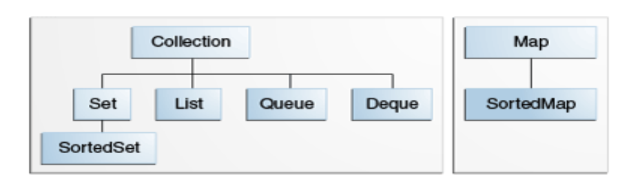

# Contents
{:.no_toc}

* TOC
{:toc}

# Memory management

JVM takes care of memory management leaving only some configuration decisions to developers.

## Stack and Heap

These are the two memory spaces in JVM.

`Stack`

1. Created for each thread, therefore thread safe.
2. Stores local variables, references to the objects on the heap, methods.
3. Memory is freed when the methods finish executing and the variables are no longer needed, ordered (LIFO).
4. Easy, fast access.
5. `StackOverFlowError` when resources are exhausted, the available memory can be configured with the `-Xss` option.

`Heap`

1. Created with an application, it's shared among all threads.
2. Stores the objects and their fields.
3. Needs complex memory management techniques like Garbage Collectors to free memory space, there is no order or memory 
allocation pattern.
4. Access is slower.
5. `OutOfMemoryError` when resources are exhausted, the available memory can be configured with the `-Xmx` and `-Xms` 
options.

## Generations

Heap memory stores objects according to their age.

`Young Generation`

1. Stores new objects.
2. Is cleared with `minor garbage collection`.
3. If an object lives long enough it is promoted to Old Generation.

`Old Generation`

1. Stores the objects promoted from Young Generation.
2. Is cleared with `major garbage collection`.

## Metaspace

It is an off-heap [memory manager used to allocate memory for class metadata](https://wiki.openjdk.java.net/display/HotSpot/Metaspace). 
When a class loader gets collected, all class metadata it accumulated is released.

## Garbage collection

Automatic management for clearing the memory from all objects from Young and Old Generations that are no longer needed.

`Garbage-First (G1) Garbage Collector` is selected by default on most system configurations. This collector is mostly 
concurrent, it scales well and keeps garbage collection pauses short.

Manual selection of a garbage collector:

1. Adjust the size of the heap space first.
2. If that doesn't help, follow the [Oracle guidelines for selecting a collector](https://docs.oracle.com/en/java/javase/17/gctuning/available-collectors.html#GUID-9E4A6B11-BB94-424F-90EF-401287A1C333):
* `serial` collector for application with small data set, run on a single processor, without pause-time requirements;
* `parallel` collector when peak app performance is a priority and there are no pause-time requirements;
* `mostly concurrent` collector when response time is more important than overall throughput and short collection pauses
are required;
* `fully concurrent` collector when response time is a high priority.

# Collections

The core collection interfaces are shown in the image below:

General facts:

1. Note, that a `Map` is not a *true* `Collection`. However, it's generally discussed among other collections for the sake of simplicity.
2. Collection interfaces are `generic`. Therefore, we should specify the type of object contained in the collection we're declaring.
3. The modification operations in each interface are designated optional. Consult documentation of the selected 
implementation to make sure you won't get `UnsupportedOperationException` by calling a method that isn't implemented. 

Below you'll find the primary implementations of the collection interfaces

### List

* insertion order
* duplicate values allowed
* we control where in the list each element is inserted and can access elements by their index
* the `List.of()` and `List.copyOf` methods return unmodifiable sets
* [https://docs.oracle.com/en/java/javase/17/docs/api/java.base/java/util/List.html](https://docs.oracle.com/en/java/javase/17/docs/api/java.base/java/util/List.html)

`ArrayList`

* optimized for storing objects, fast random access
* permits null elements
* resizable, the `ensureCapacity` method may reduce the amount of incremental reallocation
* fail-fast behavior of an iterator cannot be guaranteed in the presence of unsynchronized concurrent modification
* the `Collections.synchronizedList(new ArrayList(...));` provides synchronization
* [https://docs.oracle.com/en/java/javase/17/docs/api/java.base/java/util/ArrayList.html](https://docs.oracle.com/en/java/javase/17/docs/api/java.base/java/util/ArrayList.html)

`LinkedList`

* optimized for data manipulation 
* permits null elements
* fail-fast behavior of an iterator cannot be guaranteed in the presence of unsynchronized concurrent modification
* the `Collections.synchronizedList(new LinkedList(...));` provides synchronization
* [https://docs.oracle.com/en/java/javase/17/docs/api/java.base/java/util/LinkedList.html](https://docs.oracle.com/en/java/javase/17/docs/api/java.base/java/util/LinkedList.html)

`CopyOnWriteArrayList`

* a thread-safe variant of `ArrayList`
* performant if read-only operations vastly outnumber mutative operations and the set size stays small
* we iterate over an immutable snapshot of the content
* the iterator won't reflect changes to the list since the iterator was created
* all mutative operations are implemented by making a fresh copy
* [https://docs.oracle.com/en/java/javase/17/docs/api/java.base/java/util/concurrent/CopyOnWriteArrayList.html](https://docs.oracle.com/en/java/javase/17/docs/api/java.base/java/util/concurrent/CopyOnWriteArrayList.html)

### Set

* unique values
* unspecified behaviour if the value of an element is changed in a manner that affects `equals` (caution when storing mutable objects)
* fail-fast behavior of an iterator cannot be guaranteed in the presence of unsynchronized concurrent modification
* the `Set.of()` and `Set.copyOf` methods return unmodifiable sets
* [https://docs.oracle.com/en/java/javase/17/docs/api/java.base/java/util/Set.html](https://docs.oracle.com/en/java/javase/17/docs/api/java.base/java/util/Set.html)

`HashSet`

* not ordered
* permits the null element
* don't set the initial capacity too high if iteration performance is important
* useful for counting, reports
* the `Collections.synchronizedSet(new HashSet(...));` provides synchronization
* [https://docs.oracle.com/en/java/javase/17/docs/api/java.base/java/util/HashSet.html](https://docs.oracle.com/en/java/javase/17/docs/api/java.base/java/util/HashSet.html)

`LinkedHashSet`

* insertion order
* permits the null element
* iteration times for this class are unaffected by capacity
* useful when we need to keep insertion order of the elements
* the `Collections.synchronizedSet(new LinkedHashSet(...));` provides synchronization
* [https://docs.oracle.com/en/java/javase/17/docs/api/java.base/java/util/LinkedHashSet.html](https://docs.oracle.com/en/java/javase/17/docs/api/java.base/java/util/LinkedHashSet.html)

`TreeSet`

* elements are ordered using their natural ordering, or by a Comparator provided at creation time
* element comparison is done using `compareTo()` method and not `equals` like in the Set interface
* the `Collections.synchronizedSortedSet(new TreeSet(...));` provides synchronization
* [https://docs.oracle.com/en/java/javase/17/docs/api/java.base/java/util/TreeSet.html](https://docs.oracle.com/en/java/javase/17/docs/api/java.base/java/util/TreeSet.html)

`EnumSet`

* all elements must come from a single enum type
* doesn't permit the null element (`NullPointerException`)
* very compact and efficient, operations are likely (though not guaranteed) to be much faster than their `HashSet` counterparts
* the `Collections.synchronizedSet(EnumSet.noneOf(MyEnum.class));` provides synchronization
* [https://docs.oracle.com/en/java/javase/17/docs/api/java.base/java/util/EnumSet.html](https://docs.oracle.com/en/java/javase/17/docs/api/java.base/java/util/EnumSet.html)

`CopyOnWriteArraySet`

* uses an internal `CopyOnWriteArrayList` for all of its operations. Thus, it shares the same basic properties.
* [https://docs.oracle.com/en/java/javase/17/docs/api/java.base/java/util/concurrent/CopyOnWriteArraySet.html](https://docs.oracle.com/en/java/javase/17/docs/api/java.base/java/util/concurrent/CopyOnWriteArraySet.html)

`ConcurrentSkipListSet`

* elements are ordered using their natural ordering, or by a Comparator provided at creation time
* doesn't permit the null element
* iterating in ascending order is faster that in descending order
*[https://docs.oracle.com/en/java/javase/17/docs/api/java.base/java/util/concurrent/ConcurrentSkipListSet.html](https://docs.oracle.com/en/java/javase/17/docs/api/java.base/java/util/concurrent/ConcurrentSkipListSet.html)

### Map

`HashMap`
`LinkedHashMap`
`TreeMap`

## Time complexity matrix

Wide tables have a horizontal scroll to access columns outside the normal viewport.

| List                 | add()                           | remove()                   | get()                      | contains() | next()                     | Underlying data structure |
|:---------------------|:--------------------------------|:---------------------------|:---------------------------|:-----------|:---------------------------|:--------------------------|
| ArrayList            | O(n) (*)                        | O(n)                       | *O(1)*{: .text-green-000 } | O(n)       | *O(1)*{: .text-green-000 } | Array                     |
| LinkedList           | *O(1)*{: .text-green-000 } (**) | *O(1)*{: .text-green-000 } | O(n)                       | O(n)       | *O(1)*{: .text-green-000 } | Linked List               |
| CopyOnWriteArrayList | O(n)                            | O(n)                       | *O(1)*{: .text-green-000 } | O(n)       | *O(1)*{: .text-green-000 } | Array                     |

(*) O(1) if a copy is not needed

(**) O(n) if `add(index i)`

| Set                   | add()                          | remove()                       | contains()                     | next()                         | size()                     | Underlying data structure                                                         |
|:----------------------|:-------------------------------|:-------------------------------|:-------------------------------|:-------------------------------|:---------------------------|:----------------------------------------------------------------------------------|
| HashSet               | *O(1)*{: .text-green-000 }     | *O(1)*{: .text-green-000 }     | *O(1)*{: .text-green-000 }     | O(h/n)                         | *O(1)*{: .text-green-000 } | Hash Map                                                                          |
| LinkedHashSet         | *O(1)*{: .text-green-000 }     | *O(1)*{: .text-green-000 }     | *O(1)*{: .text-green-000 }     | *O(1)*{: .text-green-000 }     | *O(1)*{: .text-green-000 } | Hash Table + Linked List                                                          |
| EnumSet               | *O(1)*{: .text-green-000 }     | *O(1)*{: .text-green-000 }     | *O(1)*{: .text-green-000 }     | *O(1)*{: .text-green-000 }     | *O(1)*{: .text-green-000 } | Bit Vector                                                                        |
| TreeSet               | *O(log(n))*{: .text-blue-000 } | *O(log(n))*{: .text-blue-000 } | *O(log(n))*{: .text-blue-000 } | *O(log(n))*{: .text-blue-000 } | *O(1)*{: .text-green-000 } | [Red-black tree](https://en.wikipedia.org/wiki/Red%E2%80%93black_tree)            |
| CopyOnWriteArraySet   | O(n)                           | O(n)                           | O(n)                           | *O(1)*{: .text-green-000 }     | *O(1)*{: .text-green-000 } | CopyOnWriteArrayList                                                              |
| ConcurrentSkipListSet | *O(log(n))*{: .text-blue-000 } | *O(log(n))*{: .text-blue-000 } | *O(log(n))*{: .text-blue-000 } | *O(1)*{: .text-green-000 }     | O(n)                       | ConcurrentSkipListMap                                                             |

| Queue                 | offer()                        | peek()                     | poll()                         | remove()                   | size()                     | Underlying data structure |
|:----------------------|:-------------------------------|:---------------------------|:-------------------------------|:---------------------------|:---------------------------|:--------------------------|
| PriorityQueue         | *O(log(n))*{: .text-blue-000 } | *O(1)*{: .text-green-000 } | *O(log(n))*{: .text-blue-000 } | O(n)                       | *O(1)*{: .text-green-000 } | Priority Heap             |
| LinkedList            | *O(1)*{: .text-green-000 }     | *O(1)*{: .text-green-000 } | *O(1)*{: .text-green-000 }     | *O(1)*{: .text-green-000 } | *O(1)*{: .text-green-000 } | Array                     |
| ArrayDequeue          | *O(1)*{: .text-green-000 }     | *O(1)*{: .text-green-000 } | *O(1)*{: .text-green-000 }     | O(n)                       | *O(1)*{: .text-green-000 } | Linked List               |
| ConcurrentLinkedQueue | *O(1)*{: .text-green-000 }     | *O(1)*{: .text-green-000 } | *O(1)*{: .text-green-000 }     | O(n)                       | O(n)                       | Linked List               |
| ArrayBlockingQueue    | *O(1)*{: .text-green-000 }     | *O(1)*{: .text-green-000 } | *O(1)*{: .text-green-000 }     | O(n)                       | *O(1)*{: .text-green-000 } | Array                     |
| PriorityBlockingQueue | *O(log(n))*{: .text-blue-000 } | *O(1)*{: .text-green-000 } | *O(log(n))*{: .text-blue-000 } | O(n)                       | *O(1)*{: .text-green-000 } | Priority Heap             |
| SynchronousQueue      | *O(1)*{: .text-green-000 }     | *O(1)*{: .text-green-000 } | *O(1)*{: .text-green-000 }     | O(n)                       | *O(1)*{: .text-green-000 } | None!                     |
| DelayQueue            | *O(log(n))*{: .text-blue-000 } | *O(1)*{: .text-green-000 } | *O(log(n))*{: .text-blue-000 } | O(n)                       | *O(1)*{: .text-green-000 } | Priority Heap             |
| LinkedBlockingQueue   | *O(1)*{: .text-green-000 }     | *O(1)*{: .text-green-000 } | *O(1)*{: .text-green-000 }     | O(n)                       | *O(1)*{: .text-green-000 } | Linked List               |

| Map                   | get()                          | containsKey()                  | next()                         | Underlying data structure |
|:----------------------|:-------------------------------|:-------------------------------|:-------------------------------|:--------------------------|
| HashMap               | *O(1)*{: .text-green-000 }     | *O(1)*{: .text-green-000 }     | O(h / n)                       | Hash Table                |
| LinkedHashMap         | *O(1)*{: .text-green-000 }     | *O(1)*{: .text-green-000 }     | *O(1)*{: .text-green-000 }     | Hash Table + Linked List  |
| IdentityHashMap       | *O(1)*{: .text-green-000 }     | *O(1)*{: .text-green-000 }     | O(h / n)                       | Array                     |
| WeakHashMap           | *O(1)*{: .text-green-000 }     | *O(1)*{: .text-green-000 }     | O(h / n)                       | Hash Table                |
| EnumMap               | *O(1)*{: .text-green-000 }     | *O(1)*{: .text-green-000 }     | *O(1)*{: .text-green-000 }     | Array                     |
| TreeMap               | *O(log(n))*{: .text-blue-000 } | *O(log(n))*{: .text-blue-000 } | *O(log(n))*{: .text-blue-000 } | Red-black tree            |
| ConcurrentHashMap     | *O(1)*{: .text-green-000 }     | *O(1)*{: .text-green-000 }     | O(h / n)                       | Hash Tables               |
| ConcurrentSkipListMap | *O(log(n))*{: .text-blue-000 } | *O(log(n))*{: .text-blue-000 } | *O(1)*{: .text-green-000 }     | Skip List                 |
